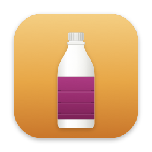

<p align="center">
  
</p>

<h1 align="center">MacColi</h1>

A native macOS desktop app for [Colima](https://github.com/abiosoft/colima) — a
Docker Desktop-style GUI that wraps the `colima` and `docker` CLIs.

Lives in the menu bar with a full dashboard window:

- **VM lifecycle & settings** — start / stop / restart Colima, live status, and
  configure CPUs, memory, disk, and runtime (docker / containerd / incus).
- **Containers** — list, run from an image, start / stop / restart / remove, open
  a shell, and opt-in live CPU/memory monitoring. Click a row to open its logs in
  a resizable window (its size is remembered) with an opt-in live tail
  (`docker logs --follow`). Right-click any row for its actions, and group
  containers into [custom lists](#custom-container-lists).
- **Images** — list, pull, remove.
- **Volumes** — list, create, remove, with per-volume disk usage.
- **Networks** — list, create, remove.

Resource panels support multi-select bulk actions and a **Clean Up** system
prune. Every panel has a filter field — press **⌘F** to focus it and narrow the
list by name, image, status, and more.

## Custom container lists

Group containers into named lists nested under the **Containers** item in the
sidebar — handy when you run many containers and want to work on one project's
set at a time. Alongside them sits **All Containers**, the full unfiltered list.

- **Create** a list from the ＋ button next to *Containers*, or select containers
  in **All Containers** (Select mode) and choose **Add to List → New List…**.
- **Rename**, **Edit** (change membership), and **Delete** a list from its
  right-click menu in the sidebar. Deleting a list never touches the containers.
- Each list reuses the whole panel — the All / Running / Stopped filter, ⌘F
  search, Select mode, and bulk Start / Stop / Restart.
- Membership is remembered by container **name**, so a list survives stop/start
  and recreation. Lists are stored locally (in `UserDefaults`) and are pure UI
  metadata — Docker itself has no notion of them.
- Inside a list, **Remove** asks whether to *remove from this list* (detach only,
  leaving the container running) or *delete the container* (`docker rm`, which
  drops it from every list). Deleting a container anywhere removes it from all
  lists.

## Requirements

- macOS 14 or later (Apple Silicon or Intel)
- [Colima](https://github.com/abiosoft/colima) and the Docker CLI:
  ```sh
  brew install colima docker
  ```
  (The app also offers an "Install Colima…" button that runs this for you.)

## Installation

### Homebrew (recommended)

```sh
brew tap Jun-Jin/maccoli
brew install --cask maccoli
```

Upgrade later with `brew upgrade --cask maccoli`.

### Direct download

Download the latest notarized `MacColi.dmg` from the
[releases page](https://github.com/Jun-Jin/MacColi/releases/latest), open it, and
drag **MacColi.app** into Applications.

The app is Developer ID–signed and notarized, so Gatekeeper opens it without
warnings.

## Build from source

### Lightweight (no Xcode) — recommended for contributors

You only need the **Command Line Tools** (~1.5–2 GB), not the full Xcode install:

```sh
xcode-select --install   # one-time, if not already present
swift run                # builds and launches the menu-bar app
```

Use `swift build -c release` to compile without launching. This path builds via
`Package.swift` and works against the same `MacColi/` sources as the Xcode
project.

Trade-offs of the lightweight build: it skips the asset catalog (which needs
Xcode's `actool`), so the dock icon is generic and the accent color falls back to
the system accent. The binary is unsigned and not bundled as a `.app`. These are
purely cosmetic/packaging differences — the app behaves identically.

### Full Xcode — for signed/notarized release builds

Open `MacColi.xcodeproj` in Xcode and run, or from the command line:

```sh
xcodebuild -scheme MacColi -configuration Debug -derivedDataPath ./.build/dd build
cp -R ./.build/dd/Build/Products/Debug/MacColi.app ./MacColi.app
open MacColi.app
```

`MacColi.app` at the repo root is the build product (git-ignored); refresh it
after each build so `open MacColi.app` runs the latest binary. Releases
(code-signed, notarized, packaged as `.dmg`) always go through this Xcode path.

## Architecture

- **Swift 6 / SwiftUI**, Observation framework (`@Observable`).
- `MacColi/App` — `@main` app (`MenuBarExtra` + dashboard `Window`) and `AppState`,
  the `@MainActor @Observable` coordinator that owns all UI state.
- `MacColi/Services` — `ProcessRunner` (async subprocess execution),
  `CLI` (binary resolution + PATH/`DOCKER_HOST` setup), `ColimaService`,
  `DockerService` (which also opens an interactive shell via
  `open -a Terminal`), and `JSONLines`.
- `MacColi/Models` — Codable models decoded from `colima list --json` and
  `docker … --format '{{json .}}'`.
- `MacColi/Views` — dashboard, menu bar, and per-resource panels.

The app shells out to the CLIs rather than speaking the Docker Engine API
directly. Docker commands are routed through Colima's socket
(`~/.colima/default/docker.sock`) so they target the Colima VM regardless of the
active docker context.

The project uses a file-system–synchronized folder group, so new files added
under `MacColi/` are picked up automatically without editing `project.pbxproj`.

## Polling & live updates

The dashboard refreshes by shelling out to `colima`/`docker` on a timer, and the
cadence backs off when no one is watching — each poll spawns subprocesses that
round-trip into the VM, so idling cheaply matters:

- **Status & resources** — every **4 s** while the dashboard window is frontmost,
  dropping to **30 s** when it is backgrounded or closed (just enough to keep the
  menu-bar status current). Returning to the foreground refreshes immediately, and
  polling pauses while a start / stop / restart operation is in flight.
- **Live CPU/memory monitoring** (opt-in, Containers panel) — samples
  `docker stats`, which itself takes ~1–2 s. The first few samples run
  back-to-back to fill the sparklines quickly, then settle to a ~7 s cycle
  (5 s pause). It runs only while monitoring is on **and** the window is frontmost.
- **Log tail** — the opt-in live tail streams `docker logs --follow` continuously
  rather than polling.

## Releases

Distributed outside the Mac App Store as a Developer ID–signed, notarized app —
it spawns `colima`/`docker` and reaches the Colima socket, which the App Store
sandbox forbids. Each tagged release builds, notarizes, and publishes
automatically, and updates the Homebrew cask.

See [docs/RELEASE_NOTES.md](docs/RELEASE_NOTES.md) for the changelog.

It manages the `default` Colima profile and is not sandboxed (it runs
subprocesses).
